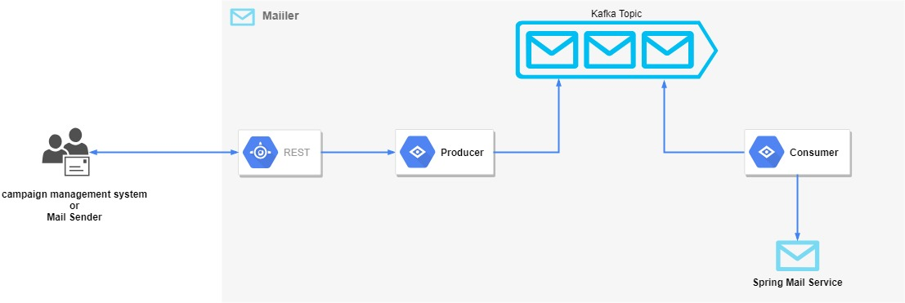

# Mailer
Micro Service responsible of Asynchronous sending of Emails

## Requirement
- REST API with synchronous acknowledgment with only one method for sending new Mail
- Mail with attachment should be possible. (Attachment Content will be provided in the request by a
URI pointing to the actual document binaries)
- Queuing until successful response from SMTP Server. Max Retry configurable.
- No Authentication required.

## Tools used
- **Spring boot** framework used to write microservice
- **Kafka** for messaging
- **Spring Retry** to automatically retry a failed operation  
- **Embedded kafka** for testing
- **Junit 4** for unit tests
- **Swagger** for API documentation
- **Maven** for build
- **google guava** for commons library
- **Spring mail** to send mail
- **Mockito** for unit tests mock

# Architecture

# Future Suggestions
